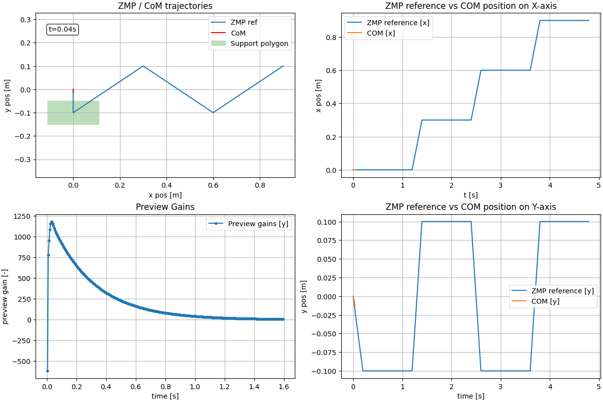
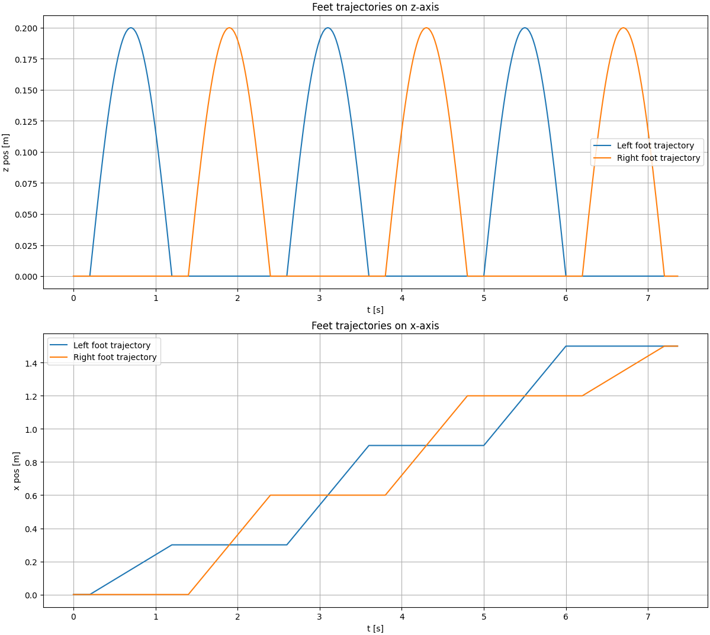

# LIPM Walking Controller

[](https://github.com/rdesarz/lipm-walking-controller/actions/workflows/build.yml)

An implementation of the **Linear Inverted Pendulum Model (LIPM)** walking pattern generator using **preview control of 
the Zero-Moment Point (ZMP)**, following _Kajita et al. “Biped Walking Pattern Generation by Using Preview Control of Zero-Moment Point.”_

The figure below shows an example of the simulated trajectory of the Center of Mass versus the ZMP reference




---

## Overview

This project reproduces the classic preview control approach for humanoid walking:

- Models the robot’s Center of Mass (CoM) with the 3D-LIPM
- Uses preview control to generate stable CoM trajectories from a desired ZMP reference
- Demonstrates tracking performance with plots and simple simulations

The implementation is kept minimal and educational, with a focus on clarity and reproducibility.

---

## Features

- Discrete-time LIPM dynamics
- Optimal preview controller (integral, state feedback, preview terms)
- Configurable preview horizon, weights `Qe`, `Qx`, `R`
- Example walking patterns with footstep plans
- Ready-to-run demos that plot ZMP vs CoM trajectories

---

## Examples

### ZMP preview control

```bash
git clone https://github.com/rdesarz/lipm-walking-controller.git
cd lipm-walking-controller
pip install ".[dev]"
python examples/step_2_lipm_preview_control.py
```

### Feet motion

In this example, we generate a trajectory for the both feet of the robot. We expect the robot to move forward. The 
trajectory of the foot is a linear on x-axis and a sinusoid on the z-axis.

```bash
git clone https://github.com/rdesarz/lipm-walking-controller.git
cd lipm-walking-controller
pip install ".[dev]"
python examples/step_3_feet_motion.py
```



### Walking controller

This example computes the inverse kinematic of the robot in order to track the computed COM reference trajectory as well
as the trajectory of the feet. We obtain the cinematic of a walking robot. However it still lacks a physical engine to 
check whether the controller is actually able to balance itself

```bash
git clone https://github.com/rdesarz/lipm-walking-controller.git
cd lipm-walking-controller
pip install ".[dev]"
git clone https://github.com/stack-of-tasks/talos-data.git talos_data
python examples/step_4_walk_inverse_kinematic.py
```

---

## Next Steps

The aim of this project is to generate walking commands for a humanoid robot in simulation. Upcoming work:

- **Physics simulation**: run the controller in Pybullet and evaluate the performance.   
- **Disturbance handling**: simulate pushes and evaluate preview controller robustness. 
- **Foot step planner**: add a foot step planner in order to move in any direction
