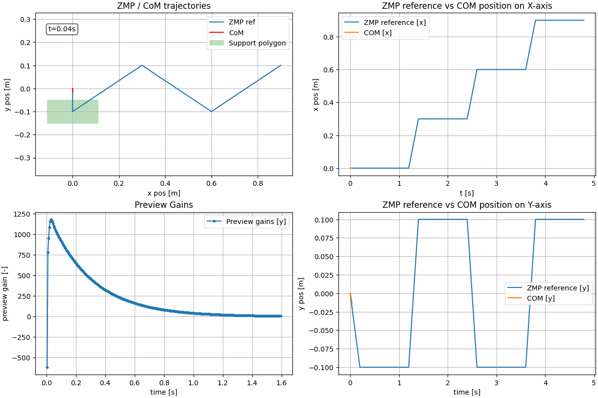

# LIPM Walking Controller

An implementation of the **Linear Inverted Pendulum Model (LIPM)** walking pattern generator using **preview control of 
the Zero-Moment Point (ZMP)**, following _Kajita et al. “Biped Walking Pattern Generation by Using Preview Control of Zero-Moment Point.”_

The figure below shows an example of the simulated trajectory of the Center of Mass versus the ZMP reference




---

## Overview

This project reproduces the classic preview control approach for humanoid walking:

- Models the robot’s Center of Mass (CoM) with the 3D-LIPM
- Uses preview control to generate stable CoM trajectories from a desired ZMP reference
- Demonstrates tracking performance with plots and simple simulations

The implementation is kept minimal and educational, with a focus on clarity and reproducibility.

---

## Features

- Discrete-time LIPM dynamics
- Optimal preview controller (integral, state feedback, preview terms)
- Configurable preview horizon, weights `Qe`, `Qx`, `R`
- Example walking patterns with footstep plans
- Ready-to-run demos that plot ZMP vs CoM trajectories

---

## Quickstart

### ZMP preview control

```bash
git clone https://github.com/rdesarz/lipm-walking-controller.git
cd lipm-walking-controller
pip install -r requirements.txt
python examples/step_2_lipm_preview_control.py
```

### Inverse kinematics

```bash
git clone https://github.com/rdesarz/lipm-walking-controller.git
cd lipm-walking-controller
pip install -r requirements.txt
git clone https://github.com/stack-of-tasks/talos-data.git talos_data
python examples/step_3_squat_inverse_kinematics.py
```

---

## Next Steps

The aim of this project is to generate walking commands for a humanoid robot in simulation. Upcoming work:

- **Footstep generation**: automatic creation of step sequences instead of hard-coded references.  
- **Inverse kinematics integration**: map CoM trajectories to joint angles using Pinocchio.  
- **Disturbance handling**: simulate pushes and evaluate preview controller robustness.  
